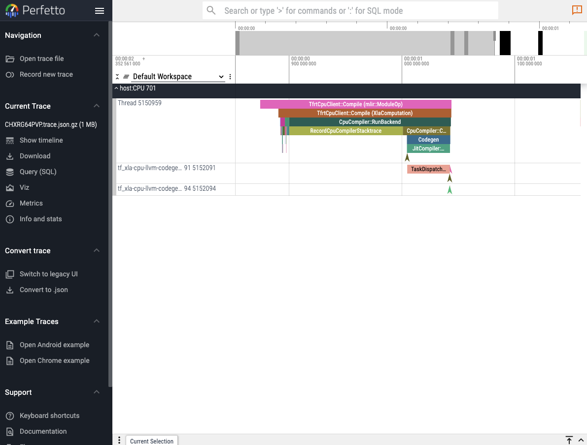
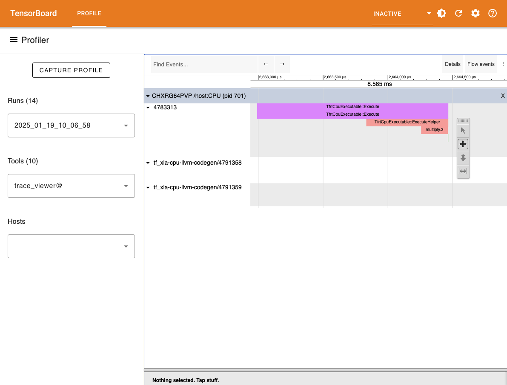

# [Profiling](@id profiling)

## Quick profiling in your terminal

!!! note

    This is only meant to be used for quick profiling or programmatically accessing the
    profiling results. For more detailed and GUI friendly profiling proceed to the next
    section.

Simply replace the use of `Base.@time` or `Base.@timed` with `Reactant.Profiler.@time` or
`Reactant.Profiler.@timed`. We will automatically compile the function if it is not already
a Reactant compiled function (with `sync=true`).

```@example profiling
using Reactant

x = Reactant.to_rarray(randn(Float32, 100, 2))
W = Reactant.to_rarray(randn(Float32, 10, 100))
b = Reactant.to_rarray(randn(Float32, 10))

linear(x, W, b) = (W * x) .+ b

Reactant.@time linear(x, W, b)
nothing # hide
```

```@example profiling
Reactant.@timed nrepeat=100 linear(x, W, b)
```

Note that the information returned depends on the backend. Specifically CUDA and TPU
backends provide more detailed information regarding memory usage and allocation (something
like the following will be displayed on GPUs):

```julia
AggregateProfilingResult(
    runtime = 0.00001235s, 
    compile_time = 0.20724930s,  # time spent compiling by Reactant
    GPU_0_bfc = MemoryProfileSummary(
        peak_bytes_usage_lifetime = 32.015 MiB,  # peak memory usage over the entire program (lifetime of memory allocator)
        peak_stats = MemoryAggregationStats(
            stack_reserved_bytes = 0 bytes,  # memory usage by stack reservation
            heap_allocated_bytes = 30.750 KiB,  # memory usage by heap allocation
            free_memory_bytes = 4.228 GiB,  # free memory available for allocation or reservation
            fragmentation = 0.0,  # fragmentation of memory within [0, 1]
            peak_bytes_in_use = 30.750 KiB # The peak memory usage over the entire program
        )
        peak_stats_time = 0.02420451s, 
        memory_capacity = 4.228 GiB # memory capacity of the allocator
    )
    flops = FlopsSummary(
        Flops = 5.180502680725853e-7,  # [flops / (peak flops * program time)], capped at 1.0
        UncappedFlops = 5.180502680725853e-7, 
        RawFlops = 4060.0,  # Total FLOPs performed
        BF16Flops = 4060.0,  # Total FLOPs Normalized to the bf16 (default) devices peak bandwidth
    )
)
```

Additionally for GPUs and TPUs, we can use the [`Reactant.@profile`](@ref) macro to profile
the function and get information regarding each of the kernels executed.

```@example profiling
Reactant.@profile linear(x, W, b)
nothing # hide
```

On GPUs this would look something like the following:

```julia
╔================================================================================╗
║ KERNEL STATISTICS                                                              ║
╚================================================================================╝

┌───────────────────┬─────────────┬────────────────┬──────────────┬──────────────┬──────────────┬──────────────┬───────────┬──────────┬────────────┬─────────────┐
│       Kernel Name │ Occurrences │ Total Duration │ Avg Duration │ Min Duration │ Max Duration │ Static Shmem │ Block Dim │ Grid Dim │ TensorCore │ Occupancy % │
├───────────────────┼─────────────┼────────────────┼──────────────┼──────────────┼──────────────┼──────────────┼───────────┼──────────┼────────────┼─────────────┤
│ gemm_fusion_dot_1 │           1 │    0.00000266s │  0.00000266s │  0.00000266s │  0.00000266s │    8.000 KiB │    64,1,1 │    1,1,1 │          ✗ │       50.0% │
│   loop_add_fusion │           1 │    0.00000157s │  0.00000157s │  0.00000157s │  0.00000157s │      0 bytes │    20,1,1 │    1,1,1 │          ✗ │       31.2% │
└───────────────────┴─────────────┴────────────────┴──────────────┴──────────────┴──────────────┴──────────────┴───────────┴──────────┴────────────┴─────────────┘

╔================================================================================╗
║ FRAMEWORK OP STATISTICS                                                        ║
╚================================================================================╝

┌───────────────────┬─────────┬─────────────┬─────────────┬─────────────────┬───────────────┬──────────┬───────────┬──────────────┬──────────┐
│         Operation │    Type │ Host/Device │ Occurrences │ Total Self-Time │ Avg Self-Time │ Device % │ Memory BW │    FLOP Rate │ Bound By │
├───────────────────┼─────────┼─────────────┼─────────────┼─────────────────┼───────────────┼──────────┼───────────┼──────────────┼──────────┤
│ gemm_fusion_dot.1 │ Unknown │      Device │           1 │     0.00000266s │   0.00000266s │   62.88% │ 1.71 GB/s │ 1.51 GFLOP/s │      HBM │
│             +/add │     add │      Device │           1 │     0.00000157s │   0.00000157s │   37.12% │ 0.12 GB/s │ 0.04 GFLOP/s │      HBM │
└───────────────────┴─────────┴─────────────┴─────────────┴─────────────────┴───────────────┴──────────┴───────────┴──────────────┴──────────┘

╔================================================================================╗
║ SUMMARY                                                                        ║
╚================================================================================╝

AggregateProfilingResult(
    runtime = 0.00002246s, 
    compile_time = 0.16447328s,  # time spent compiling by Reactant
    GPU_0_bfc = MemoryProfileSummary(
        peak_bytes_usage_lifetime = 32.015 MiB,  # peak memory usage over the entire program (lifetime of memory allocator)
        peak_stats = MemoryAggregationStats(
            stack_reserved_bytes = 0 bytes,  # memory usage by stack reservation
            heap_allocated_bytes = 31.250 KiB,  # memory usage by heap allocation
            free_memory_bytes = 4.228 GiB,  # free memory available for allocation or reservation
            fragmentation = 0.0,  # fragmentation of memory within [0, 1]
            peak_bytes_in_use = 31.250 KiB # The peak memory usage over the entire program
        )
        peak_stats_time = 0.00812043s, 
        memory_capacity = 4.228 GiB # memory capacity of the allocator
    )
    flops = FlopsSummary(
        Flops = 3.747296689092735e-6,  # [flops / (peak flops * program time)], capped at 1.0
        UncappedFlops = 3.747296689092735e-6, 
        RawFlops = 4060.0,  # Total FLOPs performed
        BF16Flops = 4060.0,  # Total FLOPs Normalized to the bf16 (default) devices peak bandwidth
    )
)
```

## [Capturing traces](@id capturing_traces)

When running Reactant, it is possible to capture traces using the [XLA profiler](https://jax.readthedocs.io/en/latest/profiling.html).
These traces can provide information about where the XLA specific parts of program spend time during compilation or execution. Note that tracing and compilation happen on the CPU even though the final execution is aimed to run on another device such as GPU or TPU. Therefore, including tracing and compilation in a trace will create annotations on the CPU.

Let's setup a simple function which we can then profile

```@example profiling
using Reactant

x = Reactant.to_rarray(randn(Float32, 100, 2))
W = Reactant.to_rarray(randn(Float32, 10, 100))
b = Reactant.to_rarray(randn(Float32, 10))

linear(x, W, b) = (W * x) .+ b
```

The profiler can be accessed using the [`Reactant.with_profiler`](@ref Reactant.Profiler.with_profiler) function.

```@example profiling
Reactant.with_profiler("./") do
    mylinear = Reactant.@compile linear(x, W, b)
    mylinear(x, W, b)
end
```

Running this function should create a folder called `plugins` in the folder provided to `Reactant.with_profiler` which will
contain the trace files. The traces can then be visualized in different ways.

!!! note
    For more insights about the current state of Reactant, it is possible to fetch device information about allocations using the [`Reactant.XLA.allocatorstats`](@ref) function.

## Perfetto UI



The first and easiest way to visualize a captured trace is to use the online [`perfetto.dev`](https://ui.perfetto.dev/) tool.
[`Reactant.with_profiler`](@ref Reactant.Profiler.with_profiler) has a keyword parameter called `create_perfetto_link` which will create a usable perfetto URL for the generated trace.
The function will block execution until the URL has been clicked and the trace is visualized. The URL only works once.

```julia
Reactant.with_profiler("./"; create_perfetto_link=true) do
    mylinear = Reactant.@compile linear(x, W, b)
    mylinear(x, W, b)
end
```

!!! note
    It is recommended to use the Chrome browser to open the perfetto URL.

## Tensorboard



Another option to visualize the generated trace files is to use the [tensorboard profiler plugin](https://www.tensorflow.org/tensorboard/tensorboard_profiling_keras).
The tensorboard viewer can offer more details than the timeline view such as visualization for compute graphs.

First install tensorboard and its profiler plugin:

```bash
pip install tensorboard tensorboard-plugin-profile
```

And then run the following in the folder where the `plugins` folder was generated:

```bash
tensorboard --logdir ./
```

## Adding Custom Annotations

By default, the traces contain only information captured from within XLA.
The [`Reactant.Profiler.annotate`](@ref) function can be used to annotate traces for Julia code evaluated *during tracing*.

```julia
Reactant.Profiler.annotate("my_annotation") do
    # Do things...
end
```

The added annotations will be captured in the traces and can be seen in the different viewers along with the default XLA annotations.
When the profiler is not activated, then the custom annotations have no effect and can therefore always be activated.
