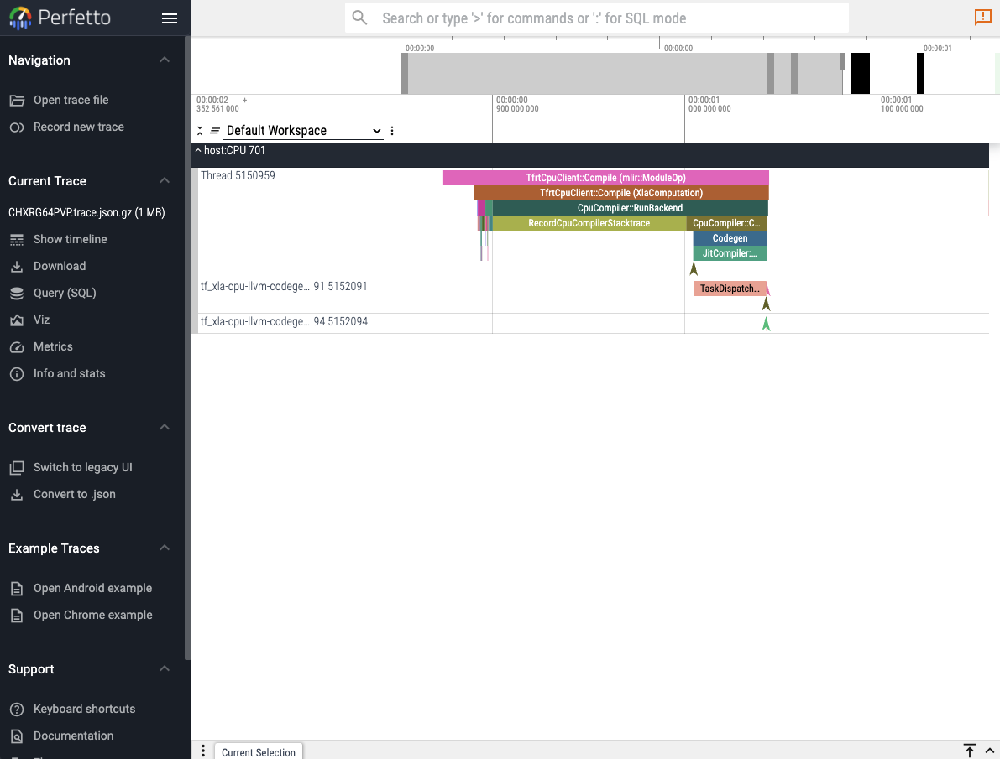
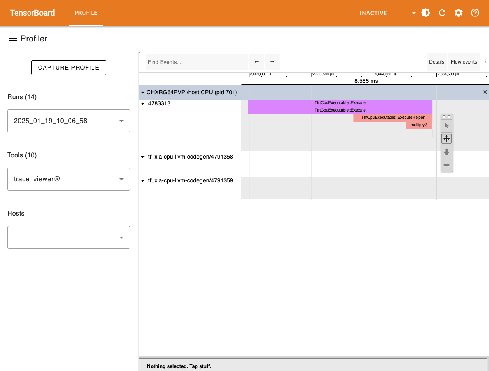

# Profiling {#profiling}

## Capturing traces {#Capturing-traces}

When running Reactant, it is possible to capture traces using the [XLA profiler](https://jax.readthedocs.io/en/latest/profiling.html). These traces can provide information about where the XLA specific parts of program spend time during compilation or execution. Note that tracing and compilation happen on the CPU even though the final execution is aimed to run on another device such as GPU or TPU. Therefore, including tracing and compilation in a trace will create annotations on the CPU.

Let&#39;s setup a simple function which we can then profile

```julia
using Reactant

x = Reactant.to_rarray(randn(Float32, 100, 2))
W = Reactant.to_rarray(randn(Float32, 10, 100))
b = Reactant.to_rarray(randn(Float32, 10))

linear(x, W, b) = (W * x) .+ b
```


```
linear (generic function with 1 method)
```


The profiler can be accessed using the [`Reactant.with_profiler`](/api/api#Reactant.Profiler.with_profiler) function.

```julia
Reactant.with_profiler("./") do
    mylinear = Reactant.@compile linear(x, W, b)
    mylinear(x, W, b)
end
```


```
10×2 ConcretePJRTArray{Float32,2}:
 -8.39155    20.8677
 -0.367122   -7.30162
  3.72382     4.56004
 13.8861     -7.72031
 10.6977     11.2561
  1.78441   -14.8262
 -8.38542   -15.9385
 -7.70785     4.02141
  4.91495   -12.7731
  3.91254    19.4607
```


Running this function should create a folder called `plugins` in the folder provided to `Reactant.with_profiler` which will contain the trace files. The traces can then be visualized in different ways.

::: tip Note

For more insights about the current state of Reactant, it is possible to fetch device information about allocations using the [`Reactant.XLA.allocatorstats`](/api/xla#Reactant.XLA.allocatorstats) function.

:::

## Perfetto UI {#Perfetto-UI}





The first and easiest way to visualize a captured trace is to use the online [`perfetto.dev`](https://ui.perfetto.dev/) tool. [`Reactant.with_profiler`](/api/api#Reactant.Profiler.with_profiler) has a keyword parameter called `create_perfetto_link` which will create a usable perfetto URL for the generated trace. The function will block execution until the URL has been clicked and the trace is visualized. The URL only works once.

```julia
Reactant.with_profiler("./"; create_perfetto_link=true) do
    mylinear = Reactant.@compile linear(x, W, b)
    mylinear(x, W, b)
end
```


::: tip Note

It is recommended to use the Chrome browser to open the perfetto URL.

:::

## Tensorboard {#Tensorboard}





Another option to visualize the generated trace files is to use the [tensorboard profiler plugin](https://www.tensorflow.org/tensorboard/tensorboard_profiling_keras). The tensorboard viewer can offer more details than the timeline view such as visualization for compute graphs.

First install tensorboard and its profiler plugin:

```bash
pip install tensorboard tensorboard-plugin-profile
```


And then run the following in the folder where the `plugins` folder was generated:

```bash
tensorboard --logdir ./
```


## Adding Custom Annotations {#Adding-Custom-Annotations}

By default, the traces contain only information captured from within XLA. The [`Reactant.Profiler.annotate`](/api/api#Reactant.Profiler.annotate) function can be used to annotate traces for Julia code evaluated _during tracing_.

```julia
Reactant.Profiler.annotate("my_annotation") do
    # Do things...
end
```


The added annotations will be captured in the traces and can be seen in the different viewers along with the default XLA annotations. When the profiler is not activated, then the custom annotations have no effect and can therefore always be activated.
